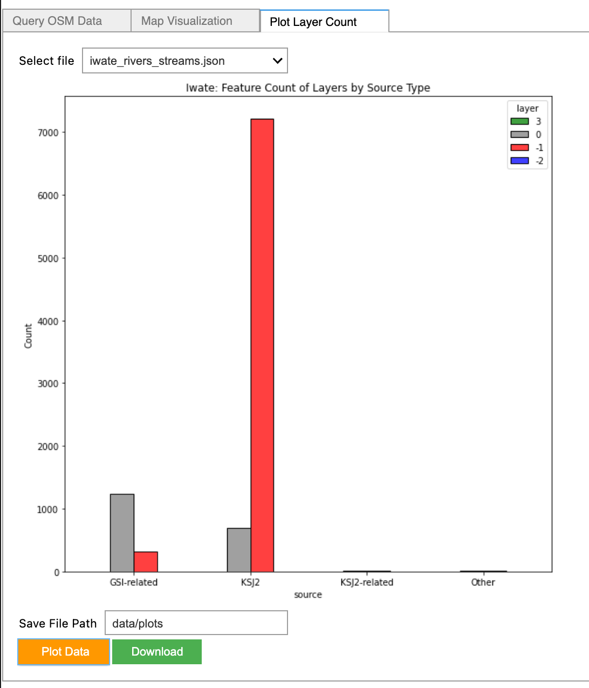

# OSM-WaterFeatures-Query

## Table of Contents  
- [Project Description](#project-description)  
- [Querying OSM](#[1]-querying-osm-and-saving-as-json-file)  
- [Mapping Data](#[2]-visualizing-geospatial-data-by-attributes)  
- [Plotting Feature Count](#[3]-plotting-feature-count)  

___

## Project Description

This tool was created to perform investigative search of river and stream features and their associated tags via the Overpass API. The intial tab allows users to query for waterways based on a specified region and save as a raw json file in a local directory. The next tab visualizes the spatial data based on the layer and/or source tags and save the geodata as either a shapefile or geojson file. Lastly, the feature counts can be plotted in a histogram associated to source and layer to identify any trends, then saved as a png file. 

## [1] Querying OSM and saving as JSON file
<figure class="image">
  
</figure>

## [2] Visualizing Geospatial Data by Attributes
<figure class="image">
  
</figure>

## [3] Plotting Feature Count
<figure class="image">
  
</figure>
